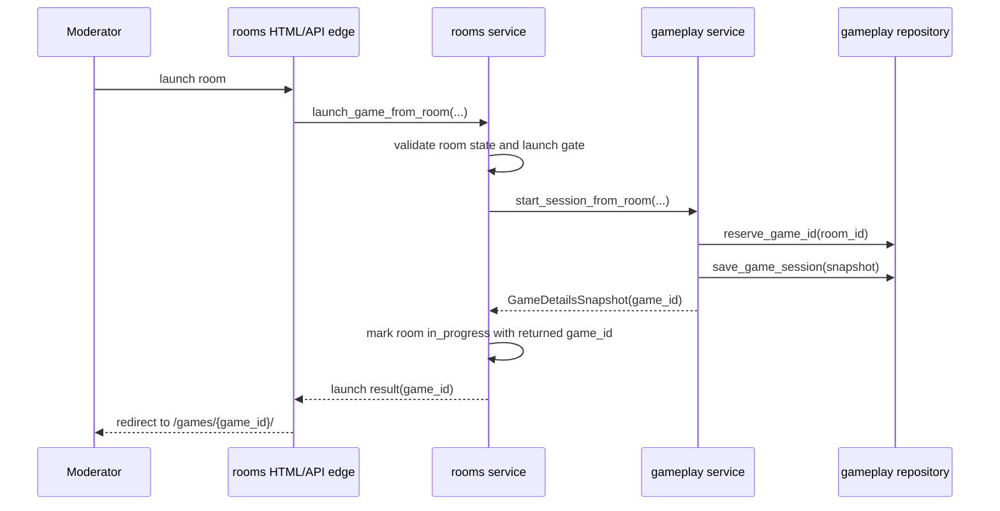
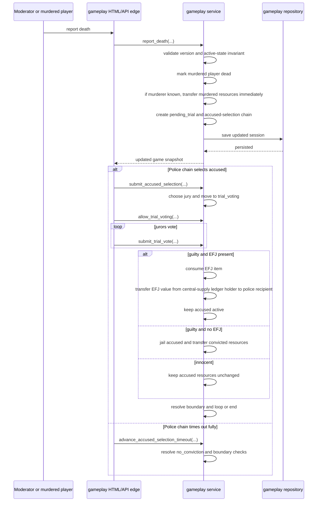

# Gameplay Sequence Diagrams

These diagrams capture the current authoritative server flow for the implemented launch handoff and confirmed-death transition.

## Room Launch Handoff

## Death Report To Boundary Resolution

